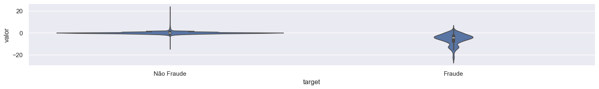
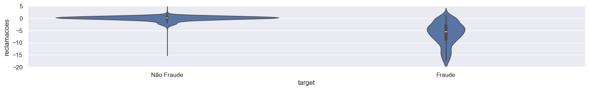
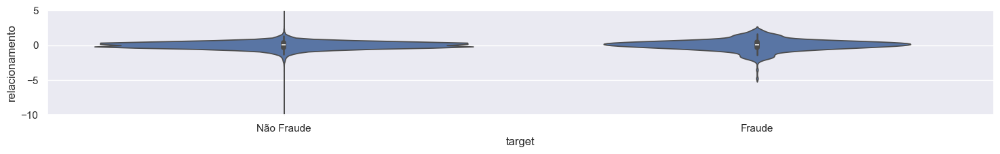
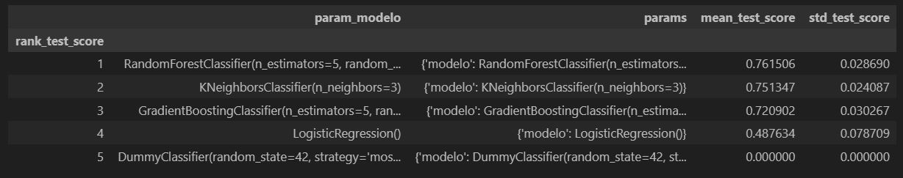
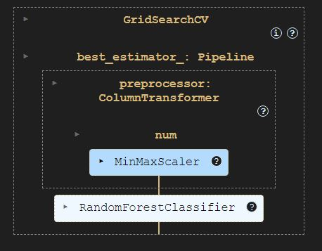
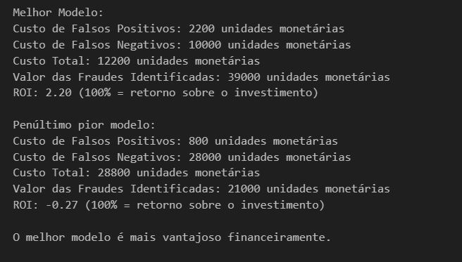

# Projeto Detecção de Fraude

Classificação para transações fraudentas ou não

## 1.	Problema de negócio
A detecção inadequada ou a falta de dados precisos sobre transações fraudulentas pode levar a prejuízos financeiros significativos, subnotificação ou supernotificação de fraudes, além de dificultar o monitoramento eficaz de comportamentos fraudulentos. Isso também pode resultar em ineficiência na alocação de recursos para investigação, levando a custos desnecessários com falsos alarmes ou, por outro lado, à não detecção de fraudes reais, o que prejudica a segurança do sistema e a confiança do cliente. A falta de precisão na classificação de transações impacta diretamente a eficácia das políticas de segurança e a confiança dos consumidores, além de prejudicar a análise de dados financeiros para futuras estratégias de prevenção.

## 2.	Objetivo
Criar um sistema robusto de detecção de fraudes que permita a identificação precisa de transações fraudulentas em tempo real. Este sistema visa reduzir a ocorrência de fraudes, minimizar os custos com investigações desnecessárias, e melhorar a alocação de recursos para a análise de transações suspeitas. Além disso, o sistema deve possibilitar a atualização contínua das regras de detecção com base nos dados mais recentes, contribuindo para a evolução das estratégias de prevenção e garantindo maior confiança e segurança nas transações financeiras.

## 3.	Premissas do negócio
Como o dataset original contém todas as variáveis do tipo inteiro e, com base na correlação observada entre as variáveis minuto, hora, dia e timestamp, é possível afirmar que essas características possuem uma forte ligação com a variável timestamp. Diante disso, a variável timestamp foi mantida no dataset, enquanto as demais foram excluídas.

## 4.	Estratégia adotada para solução

Passo 1 - Descrição dos dados: O objetivo deste passo é ter um entendimento inicial de como os dados estão relacionados com o problema de negócio proposto, para tal, lançando mão de algumas métricas estatísticas de posição e distribuição.

Passo 2 - Engenharia de atributos: Neste passo foram criadas novas variáveis a partir das variáveis originais a fim de melhorar a qualidade dos dados facilitando seu o entendimento.

Passo 3 - Filtragem das variáveis: No processo de filtragem, busca-se selecionar e reter apenas as variáveis relevantes para a análise ou modelagem, com base nos objetivos do negócio e nas características do problema em questão.
 
Passo 4 - Análise exploratória: A análise exploratória dos dados (EDA) tem como principal objetivo proporcionar uma compreensão mais aprofundada dos dados, tais como: Compreender a distribuição das variáveis numéricas e categóricas, identificar outliers (valores atípicos), se existe desbalanceamento da variável resposta, correlações entre as variáveis entre outras análises.

Passo 5 - Preparação dos dados: Neste tópico, os dados serão transformados, ou seja, as variáveis categóricas serão convertidas em números, pois os algoritmos de machine learning não tem uma boa performance com dados não numéricos. Os dados também precisarão ser reescalados, ou seja, colocar as variáveis em uma escala comum.
 
Passo 6 - Seleção das variáveis: Neste passo o principal objetivo é selecionar as variáveis mais relevantes e descartar as menos importantes, para que estas sejam submetidas aos algoritmos de machine learning. Esta seleção é feita através de algoritmos específicos de seleção, com isso, busca-se reduzir a dimensionalidade dos dados sem perder em performance ao resultado final.

Passo 7 - Treinar o modelo com as variáveis mais relevantes: Com a definição do melhor modelo de machine learning e as variável mais relevantes, busca-se otimizar ainda mais a performance do modelo com alguns ajustes finos em seus hiperparâmetros.
 
Passo 8 - Performance do negócio: Nesta etapa, o termo "performance do negócio" refere-se ao impacto que os modelos e análises têm nos resultados e metas de uma organização, pois busca garantir que as soluções propostas realmente tragam benefícios tangíveis para a empresa.

## 5.	Top 3 insights
Hipótese 1: Transações com valores elevados ou muito baixos são mais suspeitas?
Falsa: Valor com valores negativos tem maior incidência de fraude.

Hipótese 2: Usuários com muitas reclamações estão mais propensos a cometer fraudes?
Falsa: Reclamações com valores abaixo de -4 tem maior incidência de fraude

Hipótese 3: Um baixo índice de segurança está associado a fraudes anteriores?
Falsa: Índice de Segurança não é possivel afirmar que um baixo nível de segurança tem maior incidência de fraude

## 6.	Aplicação do modelo de machine learning
Foram realizados testes com diversos algoritmos de machine learning, aplicando a técnica de cross-validation com estratificação devido ao desbalanceamento dos dados (característica comum em problemas de fraude), além de um ajuste fino dos parâmetros.

## 7.	Performance do modelo de machine learning
O algoritmo de machine learning escolhido foi o RandomForestClassifier, pois para o problema de negócio em questão a métrica mais relevante seria o RECALL e este algoritmo teve o melhor desempenho neste quesito.
 

## 8.	Resultado do negócio
Neste projeto, o cálculo de Custo Total e ROI (Retorno sobre o Investimento) é fundamental para avaliar a performance dos modelos de detecção de fraude. Abaixo estão os passos utilizados para calcular esses valores e a forma como os custos foram definidos.

Passos para calcular:

1. Obtenção dos valores da matriz de confusão:
2. Definindo os dados dos dois modelos:

**Melhor modelo**

fp_model1 = 22 # Falsos Positivos
fn_model1 = 20 # Falsos Negativos
tp_model1 = 78 # Verdadeiros Positivos
tn_model1 = 56842 # Verdadeiros Negativos

# Penúltimo pior modelo

fp_model2 = 8  # Falsos Positivos
fn_model2 = 56 # Falsos Negativos
tp_model2 = 42 # Verdadeiros Positivos
tn_model2 = 56856 # Verdadeiros Negativos

3. Definindo os custos:
   
Custo por investigação de falsos positivos: Custo de identificar erroneamente uma fraude.
custo_por_investigacao_fp = 100 # Custo por investigação de Falsos Positivos (em unidades monetárias)

Valor recuperado por fraude identificada: O valor financeiro recuperado a partir de fraudes corretamente identificadas.
valor_recuperado_por_fraude = 500 # Valor recuperado por fraude identificada (em unidades monetárias)

Custo de oportunidade por falsos negativos: O custo de não identificar uma fraude (perda de oportunidade).
custo_oportunidade_fn = 500 # Custo de oportunidade por Falsos Negativos (em unidades monetárias)

4. Cálculos: 

Cálculo do Custo Total: Soma dos custos com falsos positivos e falsos negativos.
Cálculo do Valor Recuperado por Fraude Identificada: Multiplicação do número de fraudes identificadas corretamente pelo valor recuperado por fraude.
Cálculo do ROI: Retorno sobre o investimento, calculado a partir do valor recuperado das fraudes e dos custos totais.

 

Neste caso, a proporção do custo de internação por paciente em relação a uma classificação com algoritmo de média em comparação com o melhor algoritmo resulta em uma redução de mais de 60%.

## 9.	Conclusão
Neste trabalho, o objetivo foi analisar um modelo de detecção de fraudes utilizando dados desbalanceados e testar hipóteses sobre o comportamento das transações e dos usuários. Algumas hipóteses foram refutadas, oferecendo insights para aprimorar o modelo.

A primeira hipótese, que sugeria que transações com valores elevados ou muito baixos seriam mais suspeitas, foi refutada, pois valores negativos mostraram maior incidência de fraudes. A segunda, sobre usuários com muitas reclamações, também foi refutada, com fraudes associadas a reclamações abaixo de -4. A terceira hipótese, que relacionava um baixo índice de segurança a fraudes anteriores, não pôde ser confirmada.

Ao comparar os modelos, o melhor modelo apresentou custos de falsos positivos de 2200 unidades monetárias e de falsos negativos de 10000 unidades monetárias, totalizando 12200 unidades monetárias. No entanto, o valor recuperado pelas fraudes identificadas foi de 39000 unidades monetárias, gerando um ROI de 2.20. O penúltimo pior modelo, por outro lado, teve um ROI de -0.27, indicando que não foi financeiramente vantajoso.

Portanto, o melhor modelo se mostrou mais eficaz na detecção de fraudes e proporcionou um retorno financeiro positivo, enquanto o modelo menos eficaz gerou um ROI negativo. Este trabalho destaca a importância de analisar a eficácia do modelo juntamente com os custos para otimizar a detecção de fraudes.

## 10.	Próximos passos
•	Utilizar outras técnicas para tratamento de grandes dados;

•	Testar mais algoritmos de machine learning;

•	Fazer o deploy deste projeto em ambiente cloud. 
